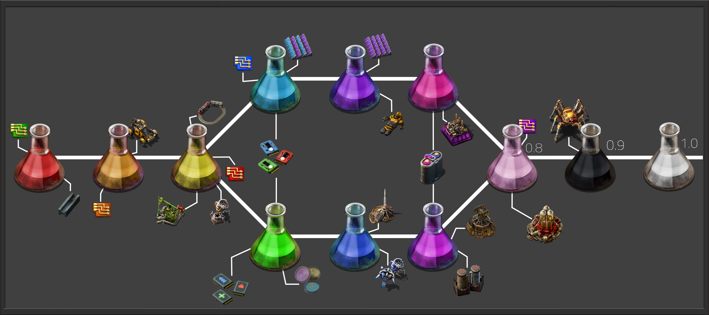

**(WIP: 0.7 is released! 0.8 will be out in the next few months.)**

This overhaul aims to add all the elements of the periodic table to Factorio. Including new and complex production chains to refine and produce new ores and resources for your growing factory, and delving deeper into chemistry and production chains than a normal vanilla playthrough. If you arent a chemistry nerd going in, you'll become one going out.

Sift through new "group ores", containing the elements of each separate periodic group (Alkali Metals, Transition Metals, etc) which can be broken down using new fluids or items to get a specific new resource, all in the name of expansion. Of course, not all elements can just be found in the ground; you'll have to search through air, sea and ground to get everything you need to build further and research more.
*  * *
##**Your science and you**

This mod expands the vanilla science tree out to 12 unique science packs, all based around and requiring a specific periodic group (Transition metals, Reactive non-metals, Actinides, etc etc) to produce. The science tree also branches off at an earlier state, which gives you more choice for what to specalise in. Each side of the tech tree unlock different or better recipes, buildings and bonus technologies to improve or expand your factory.
Some technologies require both sides of the tech tree to be unlocked, most notably things like modules or plastic science bottles - these take more packs to produce, but unlock more powerful things.

Here are the time ranges and science pack amounts that every science pack abides by - it can vary slightly below or slightly above these values, but 9/10 technologies adhere to this rule:

| Science | Amount | Time |
| ------- | ------ | ---- |
| Transition metal pack | 5-30 | 5-15s |
| Advanced transition metal pack | 30-75 | 15-30s |
| Advanced-Advanced transition metal pack | 75-150 | 30-60s |
| Post-transition/Reactive non-metals pack | 150-350 | 45-60s |
| Metalloid/Alkali metal pack | 350-450 | 60-80s |
| Advanced-Advanced Advanced transition metal/Alkaline earth metal pack | 450-600 | 80-120s |
| Noble gas pack | 600-850 | 120-160s |
| Actinide pack | 850-1000 | 160-240s |
| Lathanide pack | 1000-2000 | 240-300s |

You also have more then just science packs to put into labs, occasionally finding special items that can unlock more unusual or unique benefits to you or your factory.

* * *
# ***FEATURES***

* Complete revamp of circuit recipes, now needing breadboards, wires and integrated circuits to create usable electronics. And, of course, the higher the tier, the more complex the recipe.

* Revamped and expanded military options, with more ammo types and tweaks made to existing means to defend yourself.

* Multiple alternative recipes added for items, for more flexibility in your factory. 

* Bio-Modules: a way to upgrade yourself using artificially-made genes and chemically-sounding words that can improve your HP, reach distance and speed.

* [OBLIGATORY] 50+ buildings for you to make stupidly big malls for!

* [OBLIGATORY]  500+ recipes for you to endlessly scroll through, like you do on social media!

* Whole buncha recipe complexity, or your money back.

* Separated technologies at an earlier stage, so you can pick and choose what you want to unlock without needing to get every science pack at 60SPM.

* Complete lack of maturity.

* Complete overhaul of petrochem (just like every other overhaul) and oil processing, separating crude oil into 8 fractions that each have their own uses.

* More ways to get resources than just "find patch", instead having specific buildings/items that can get specific resources (like gaseous elements).

* Multiple and unique ore/element processing steps, while still having copy-pastable builds.

* Expansion of vanilla recipes and products, e.g lubricant being tiered and being a more in-depth recipe chain.

#***The Periodometer: 59/118***

***Transition Metals: (28/34)***
• Iron
• Copper
• Nickel
• Zinc
• Manganese
• Mercury
• Gold 
• Silver
• Titanium 
• Tungsten
• Cadmium 
• Chromium
• Vanadium
• Palladium
• Platinum
• Zirconium
• Cobalt
• Molybdenum
• Yttrium
• Osmium
• Iridium
• Ruthenium
• Rhodium
• Rhenium
• Tantalum
• Niobium
• Technectium
• Dubnium

***Post Transition Metals: (9/9)***
• Aluminium 
• Bismuth
• Indium
• Thallium
• Gallium
• Polonium
• Lead
• Tin
• Astatine

***Metalloids: (6/6)***
• Arsenic
• Antimony
• Boron
• Silicon
• Tellurium
• Germanium

***Reactive Non-Metals: (11/11)***
• Oxygen
• Nitrogen
• Chlorine
• Carbon
• Hydrogen
• Sulfur
• Phosphorus
• Fluorine
• Bromine
• Iodine
• Selenium

***Alkali Metals: (6/6)***
• Sodium
• Lithium
• Potassium
• Rubidium
• Caesium
• Francium

***Alkaline Earth Metals: (6/6)***
• Calcium
• Beryllium
• Magnesium
• Strontium
• Barium
• Radium

***Noble Gases: (2/6)***
• Helium
• Argon

***Lanthanides: (0/15)***

***Actinides: (1/15)***
• Uranium

***Crowdin and translating PM:***
Periodic Madness uses crowdin for its translations, which you can contribute to here: https://crowdin.com/project/factorio-mods-localization

***Touched by a madman (Mod compatability):***
• Mini Trains

***REVIEWS 2.0:***
"I do have to say the titles of each of your updates make me blow air out my nose" -PennyJim
"You are doing The Lord's work. Specifically, Lord Kelvin's. Also Rutherford, Bohr and Curie." -Nex